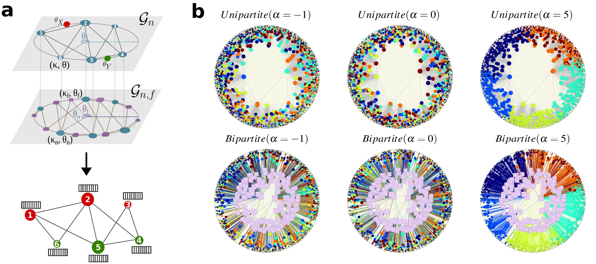

# Hyperbolic Benchmarking Unveils Network Topology-Feature Relationship in GNN Performance

A comprehensive benchmarking framework for graph machine learning, focusing on the performance of GNNs across varied network structures.


<p align="center">
<b>(a)</b> Representation of a model-based framework integrating $\mathbb{S}^1$ and bipartite-$\mathbb{S}^1$ models to generate rich graph-structured data. <b>(b)</b> Hyperbolic representation of a synthetic network with 2000 nodes represented as circles, where colors indicate their labels, and 200 features depicted as purple rounded squares. The size of the symbols is proportional to the logarithms of the degrees of nodes and features.
</p>

## Running the benchmark

1. Generate synthetic networks or download from Zenodo (https://zenodo.org/records/11473505)

    ```bash
    cd src/
    python generate_synthetic_networks.py [config_file.yaml]
    ```

    The example config file is located in `config/net_test.yaml`. 
    
    The script creates a folder which name contains all the parameters for each set of parameters in the config file.


2. Run benchmark on generated dataset

    ```bash
    cd hgcn/
    # Follow instractions there to install necessary libraries
    
    # Copy datasets into data/ folder
    cp -r "../src/output*" data/

    # Run experiments for a given model and downstream task
    python run_ml_models_on_S1.py nc HGCN
    ```


## Properties of the real dataset

You can measure the properties of your graph data using `notebooks/extract-parameters-from-real-networks.ipynb`. For $\beta$ inference please refer to [Mercator](https://github.com/networkgeometry/mercator) or [D-Mercator](https://github.com/networkgeometry/d-mercator). These libraries are model-based embedding tools to map a network into (multidimensional) hyperbolic spaces.


## Citation

If you find our benchmark or data useful, please cite our paper:

```
@misc{aliakbarisani2024hyperbolic,
      title={Hyperbolic Benchmarking Unveils Network Topology-Feature Relationship in GNN Performance}, 
      author={Roya Aliakbarisani and Robert Jankowski and M. Ángeles Serrano and Marián Boguñá},
      year={2024},
      eprint={2406.02772},
      archivePrefix={arXiv},
      primaryClass={cs.LG}
}
```